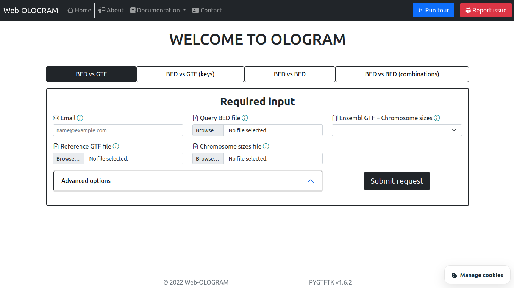

# Web-OLOGRAM

## About :

This is the implementation of the OLOGRAM (OverLap Of Genomic Regions Analysis using Monte Carlo) tool as a web application using the LARAVEL framework.

For more information about OLOGRAM click [here](https://dputhier.github.io/pygtftk/ologram.html).
For more information about LARAVEL click [here](https://laravel.com/).

The OLOGRAM tool is part of the PYGTFTK (Python GTF Toolkit) project.

For more information about PYGTFTK click [here](https://dputhier.github.io/pygtftk/index.html).


## Prerequisites :

*Note* : This tool has been tested thoroughly on ubuntu 20.04.

You must have Docker and Docker Compose installed on your computer to launch the application correctly.

If you need to install these components follow the instructions on the following website depending on your operating system : 
- https://docs.docker.com/compose/install/

=> It is recommended to install docker version 20.10 or above and docker-compose version 1.25 or above.

You also need Git in order to clone the repository locally :
- https://git-scm.com/book/en/v2/Getting-Started-Installing-Git


## Getting Started :

Once you have the prerequisites set up you can run the following commands :

```bash
git clone https://github.com/Ouertani95/Web_OLOGRAM
cd Web_OLOGRAM/
sudo groupadd docker
sudo adduser sail
usermod -aG docker sail
newgrp docker

```

## Usage :

Type the following commands to launch the webapplication :

```bash
alias sail='[ -f sail ] && bash sail || bash vendor/bin/sail'
sail up -d
sail artisan migrate
```
Now open your web browser and go to localhost.
You should have the following page :



## Troubleshooting :

If you have a problem running sail commands or docker without root priviliges type the following commands :

```bash
sudo groupadd docker
sudo usermod -aG docker $USER
newgrp docker
```

Now you can run any docker or sail command from your account.

## App file structure :

If you're unfamiliar with the LARAVEL file structure here's a quick guide to find the most important files :

- The main entry point of the app is the **web.php** file for routing found in : <ins>routes/web.php/</ins>
- Since the app is using the **MVC** (Model View Controller) structure the following files can be found at :
    * Controllers (app logic): <ins>app/Http/Controllers/</ins>
    * Models (database handlers): <ins>app/Models/</ins>
    * Views (displayed web pages) : <ins>resources/views/</ins>
- The most important **parameters** of the app can be found in the **.env** file at the root of the app directory
- The **shiny** results page files can be found at : <ins>app/Shiny/</ins>
- The **Dockerfiles** used to build the **shiny** and **gtftk** docker images can be found in : <ins>storage/</ins>
   

## Authors :

**Mohamed Ouertani**